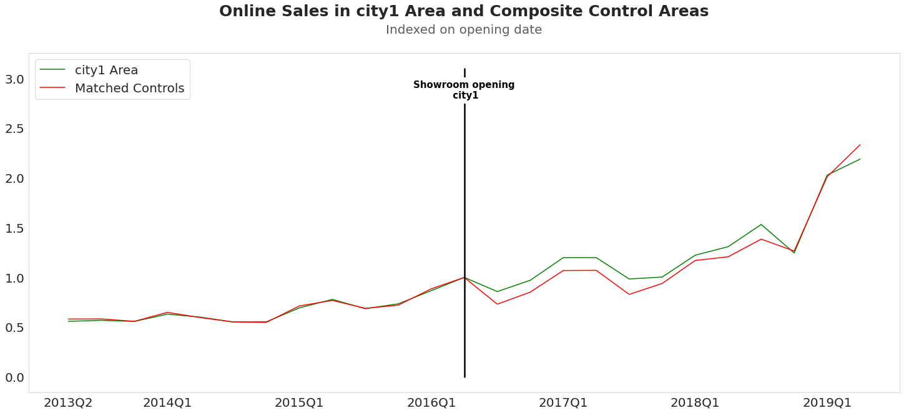
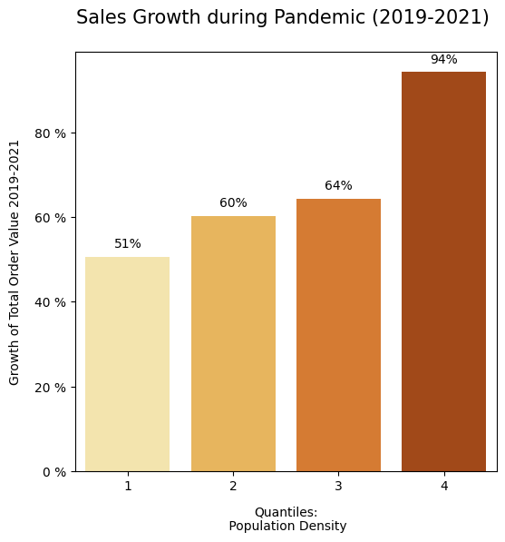
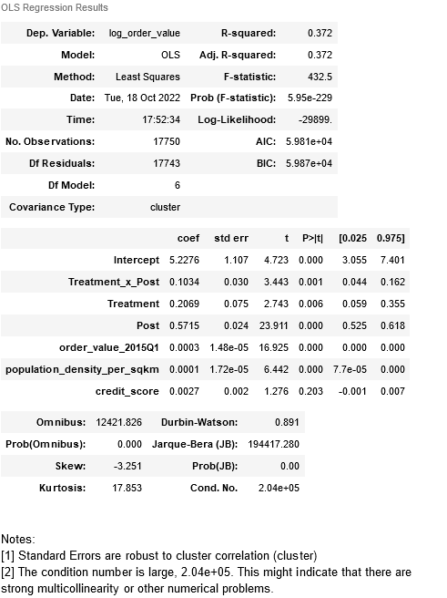
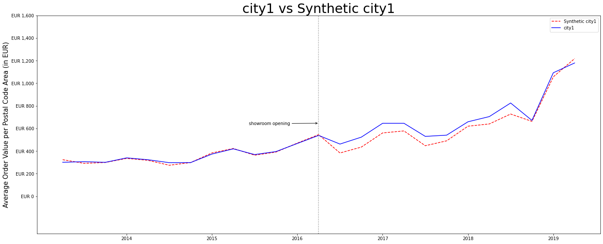

# Analysis of Omnichannel Marketing Strategy: How Much Do Offline Showrooms Increase Online Sales? *(Work-in-Progress)*

## Summary
This project for a Berlin-based e-commerce firm uses confidential online sales data to estimate the causal effect of offline showrooms on online sales. We employ synthetic control methods and difference-in-differences methods to estimate the causal parameters. The results of our analyses suggest that a brick-and-mortar showroom increases online sales in the area surrounding the showroom by between 7% and 20%. The numbers are statistically and economically significant; the more credible estimates are at the lower end of that range. In combination with the costs of operating the showrooms, a "showroom ROI" can be obtained and benchmarked against that of other marketing channels. Therefore, this project provides important inputs that support strategic decision-making on the optimal marketing mix.
<br />
<br />

<p align="center">

</p>

  *This chart shows online sales for the areas neighboring a showroom relative to matched control areas where no showroom opened. The online sales for both areas are indexed on the opening year-quarter (green: showroom "city 1", red: KNN-matched areas with no showroom)*


<br>
<br>


**Authors**: <br>
Michael Dietrich ([LinkedIn](https://www.linkedin.com/in/m-dietrich/), [Github](https://github.com/mihyael)) <br>
Benjamin Grosse-Rueschkamp ([LinkedIn](https://www.linkedin.com/in/benjamingrosserueschkamp), [Github](https://github.com/GrosserB)) <br>

**Note**: <br>
The data used for this project is confidential, hence any information shown here that could identify the firm (e.g. showroom location, opening dates, or absolute numbers) are fictionalized. This project is still work-in-progress. <br>
<br/>


## Table of Contents
- [Evaluation of Omnichannel Strategy at Berlin-based E-Commerce Company: Do Offline Showrooms Increase Online Sales? -- WORK IN PROGRESS --](#evaluation-of-omnichannel-strategy-at-berlin-based-e-commerce-company-do-offline-showrooms-increase-online-sales----work-in-progress---)
  - [Summary](#summary)
  - [Table of Contents](#table-of-contents)
  - [Description](#description)
    - [Objective](#objective)
    - [Analyses \& Results](#analyses--results)
      - [Data and Introduction](#data-and-introduction)
      - [Event-study Difference-in-Differences with K-Nearest Neighbors](#event-study-difference-in-differences-with-k-nearest-neighbors)
      - [Synthetic Control Method](#synthetic-control-method)
      - [Two-way Fixed-effects Difference-in-Difference](#two-way-fixed-effects-difference-in-difference)
      - [Discussion \& Summary of Results](#discussion--summary-of-results)
    - [So-What](#so-what)
  - [Overview](#overview)
    - [File Structure](#file-structure)
    - [Authors, Acknowledgements](#authors-acknowledgements)
  - [Detailed Project Description](#detailed-project-description)
    - [Overview](#overview-1)
    - [Objectives](#objectives)
    - [Methods Used](#methods-used)
    - [Installation](#installation)
    - [Data Processing / Preparation / Loading / Saving](#data-processing--preparation--loading--saving)
    - [Further Insights Into Data Preprocessing](#further-insights-into-data-preprocessing)
- [Bootcamp Legacy Contents](#bootcamp-legacy-contents)
- [Startup the project](#startup-the-project)
- [Installation](#installation-1)


## Description
### Marketing Attribution Objective & Causal Inference Challenge

Omnichannel marketing is fast becoming a central pillar in B2C marketing. In particular, e-commerce companies increasingly use brick-and-mortar showrooms to not only showcase the product in real-life but also to create brand awareness. Designing an effective marketing strategy requires accurate estimates on the impact of each channel in order to maximize the overall marketing ROI. Obtaining these estimates for the showroom channel is the objective of this project. <br>

We collaborate with a Berlin-based e-commerce company to analyze and quantify the causal impact of their brick-and-mortar showrooms on online sales. We are provided confidential order data of every order made during our sample period. Several new showrooms are opened during that time period. The showrooms provide product and brand information offline but both order process and fulfillment are online. Conceptually, we solve the marketing attribution problem using methods from the causal inference toolkit. <br>

The challenge is to ensure that we don't misinterpret mere correlations as causal relationships but instead recover as accurate as possible the true underlying parameters. The fundamental idea behind the analysis is to view the opening of new showrooms as a number of geographically separated quasi-experiments. This allows us to construct treatment and control groups. In the treatment group are customers that are geographically close to a newly opened store and thus are exposed to the showroom channel with some probability. In the control group are locations that further away from showrooms and thus less likely to be affected to this marketing channel. <br>

A particular methodological concern in this setting are potentially hidden factors that impact sales and that are also correlated to treatment ("omitted variable bias"). In particular, all showrooms are located in urban areas. However, consumers in urban areas may exhibit differential online shopping behaviors compared to consumers in rural areas even in the absence of treatment. During covid lockdowns, for example,  urban and rural consumer behavior was impacted differently. Therefore, naive comparisons of online sales in areas with showrooms vs. those without, or simple before-after comparisons are likely to be biased and would lead to misleading conclusions. <br>
<br>

<p align="center">

</p>

*Online sales growth during the covid-19 pandemic across population density quantiles. More densely populated areas increased their online order volume at a higher rate during the pandemic* <br>
<br>

To tackle these challenges and obtain robust estimates, we employ three state-of-the-art methodologies from the causal inference toolkit: (1) event-study difference-in-differences with k-nearest neigbors to select the control group, (2) synthetic control methods, and (3) heterogenous-robust two-way fixed-effects difference-in-difference estimation methods. <br>
<br>

### Analyses & Results

#### Data Preprocessing

We start by cleaning and preprocessing of the data. In the time dimension, online sales data is aggregated on the year-quarter level. On the geographic dimension, we additionally aggregate sales data on the postal code level. The location of the showrooms and of the postal codes are geocoded. We then computed the distance between each showroom-postal code pair. We define areas as "treated" if their location is <50km from a showroom that opened during our sample period, as some showrooms had opened before. We additionally augment the dataset with the population density (from public sources) and average credit score of the postal code area (provided to us by the ecommerce firm). <br>


#### Event-study Difference-in-Differences with KNN-Matched Control Group

First, we use nearest neighbor matching to construct a control group. The purpose of the control group is to provide a counterfactual to the treatment group, i.e., what would have happened to the treatment group had it not been exposed to the treatment. To obtain the control group, we match treated each postal code area with two other postal code areas using nearest neighbor matching based on on the variables (i) population density, (ii) average credit quality and (iii) total online sales of the very first time period in our data. In a multivariate regression, these three variables explain about 70% of the cross-sectional variation. We match two instead of just one control postal code to each treatment postal code to increase the sample size and thereby reduce the standard errors in our estimation. <br>


<p align="center">

</p>

 *This chart shows online sales for the areas neighboring a showroom relative to matched control areas where no showroom opened. The online sales for both areas are indexed on the opening year-quarter (green: showroom "city 1", red: KNN-matched areas with no showroom)*

Before the opening of the showroom, online sales grow at similar rates in treatment and control areas, After the showroom opens, the series diverge and the areas around the showroom increase their online order volume at a faster rate. This simple plot provides first evidence to the effect of the showroom on online sales. <br>

To analyze the effect of the showroom opening more rgiorously, we next run an event-style difference-in-differences regression: <br>

<p align="center">

</p>

The table shows the results of the following linear panel regression:<br>

<p align="center">

 </p>

This is a classical difference-in-differences regression where the variable *Post* is an indicator variable that equals one for all year-quarters after the showoom opened, and zero otherwise; the variable *Treatment* is an indicator variable that equals one for all postal code areas that are within the 50km range around the showroom, and zero for all control postal code areas. *Treatment* $\times$ *Post* is the interaction term of the two variables, and it the variable of interest. The dependent (aka "target") variable is the natural logarithm of the quarterly total order value (in EUR) in each postal code area. As the dependent variable is logarithmized, we can interpret the parameter estimate on the interaction term *Treatment* $\times$ *Post* as the mean percentage change in the dependent variable for the treated units after the opening of the showroom relative to the untreated postal code areas. Hence, the estimates for the showroom openings show an increase of 10.34%. With a p-value of 0.001, the point estimate is highly statistically significant; standard errors are clustered on the postal-code area. <br>

The results for the other showrooms are (mostly) similar in magnitude and statistical significance. <br>
<br>

#### Synthetic Control Method

We next employ the Synthetic Control Method ("SCM") to analyze the effect of the showroom opening online sales. Similarly to the previous methodology, SCM employs a control group as counterfactual, and uses the Post-treatment periods to estimate the treatment effect. The major difference lies in how the control group is constructed. SCM selects weights to construct a synthetic version of the treated unit such that the outcome in the pre-treatment periods matches the outcome of the treated unit as closely as possible. In contrast to difference-in-differences, only one (aggregate) version of the treated and control unit exists. The treatment effect in absolute numbers is the difference between the treatment area and the synthetic control area.

<p align="center">

</p>


In the pre-treatment period the outcome variable, the mean sales per postal code area of the synthetic city matches the value of the actual city closely. As the showroom opens the two series diverge visibly, suggesting a positive impact of the showroom on online sales in the area around the showroom. The absolute treatment effect is the difference between the actual value and the synthetic value (note that the EUR values shown on the y-axis are not the actual values) We obtain the percentage change by dividing the average quarterly increase over the 24 months after the showroom opening by the value in the final quarter before treatment. Averaging over the showroom openings in our sample, the analysis suggests an increase of online sales of 20%. <br>
<br>


#### Two-Way Fixed-Effects Difference-in-Difference

In the first section we use the canonical (or 'event study'-style) difference-in-differences method. The major limitation of that method is that it can only handle one event at a time and it has no "statistically clean" way to aggregate the estimates and confidence bands of multiple events. The so-called Two-Way Fixed Effects regression model ("TWFE") had become the standard solution to this problem. However, an emerging scientific literature has pointed out flaws of the original TWFE estimator (under some conditions, e.g., heterogenous or dynamic treatment effects, the estimator delivered biased results). In the following analysis, we implement a version of the TWFE estimator that corrects for some of the flaws in the original TWFE estimator introduced by [Callaway & Sant'Anna (2021)](https://www.sciencedirect.com/science/article/abs/pii/S0304407620303948). The [package](https://bcallaway11.github.io/did/articles/did-basics.html) is only available in R so for the analysis we switch to R. <br>
<br>

<p align="center">

</p>

 *This chart shows estimates of the __relative__ online sales of the areas surrounding the showrooms compared to areas with not close to a showroom (red: year-quarters before the opening, green: year-quarters after the opening). The dots are the point estimates for each year-quarter and the bars represent 95% confidence intervals. For example, in the first quarter after the opening of a showroom, online sales increase by around 15% higher. This number is statistically significant on the 95% level (as the zero line is not included in the confidence interval). This number is the average over all showrooms that opened in our sample.* <br>

While many of the point estimates are individually not statistically distinguishable from zero, the average of all showroom openings over the entire pre- and post period is. The group-time average treatment effect, i.e. the average sales increase (aggregated over all showroom openings), is 7.4% and is statistically significant at the 0.05-level.  <br>
<br>


### Summary of Results & "So What"

Marketing attribution is the process of identifying which marketing efforts are responsible for generating sales. We investigate the impact of offline showrooms on online sales for a Berlin-based ecommerce company using methods from the causal inference toolkit. Given that different methods require different assumptions, we use three different state of the art quasi-experimental methods (difference-in-differences with KNN-matched control group, synthetic control method, and two-way fixed-effects difference-in-difference) to ensure the robustness of our results. <br>

We find that the effect of offline showrooms on online sales is between 7% and 20%. This range of estimated effects is statistically and economically significant, meaning that the results are unlikely to have occurred by chance and have a meaningful impact on the business. The more credible estimates are at the lower end of the range, suggesting that the true effect of the showroom on online sales is likely to be closer to 7% than to 20%. <br>

Given the estimates, the impact of opening additional showrooms is to be set in relation to the costs to compute the marketing ROI for the showroom channel. This then needs to be compared to the ROI of alternative marketing strategies, e.g., performance-marketing or direct mail, to determine the ROI-optimal marketing mix. Hence, these results provide insights that can be used to optimize the marketing strategy. <br>
<br>
<br>


### How much can we trust the results

-- Try to put somewhere else in the text --

How much can we trust these results, and what is the most resonable single number? Given that all methods produce roughly comparable outcomes is one reason that justifies our trust in these results.

methods are well-established and have a large academic and practicioner community wide reach within the. One particular assumption is needed in all three designs: that the treatment group control group would have evolved similarly to the control group had it not been treated. Given that these methodolgoies use different ways of constructing the treatment group enhances trust.

IN particular, the TWFE method is rtobust to the parallel trend assumption holding only after conditioning on other (CITE)

RCT/ A/B Test ultimate test


Employing three different quasi-experimental methods, we find a positive effect
All of the methods employed here are quasi-experimental and let us avaiod as much as possible the omitted variable bias. At the same time,
what are threats/potential limitations
which is most credible

Clearly, there are many factors impacting the actual


Potential follow-ons: channels, other outcome variables, euro-figures for potential showrooms in cities not served by showrooms yet.

Talk about long-term vs. short-term: question: do initial gains consolidate, reverse or continue to grow?


## Overview

### File Structure


## Detailed Setup and Preprocessing Description

### Overview

All parts of the analysis are documented in the jupyter notebook `Main_Project_Notebook.ipynb` together with step-by-step explanations of methods. We provided an example dataset that serves as a basis to explain our approach. It can also be used by anyone to replicate our results.


### Installation

The package can be installed by downloading the contents of this repository/package, navigate to the folder on your command line and typing the following command:

`pip install .`

This will install the contents of this package to your current python environment. Then you should be able to use the notebooks in this package without any trouble. This also enables you to use our method for your own projects.


### Data Processing / Preparation / Loading / Saving

For the purpose of publication, all parts of the analysis start with a dataset, that has already been extensively preprocessed.

For anyone who wants to use our approach for a similar analysis, we give a detailed description of the preprocessed dataset, it's variables and data types. See also the dataset we provided.

`Description of all columns and their data types and contents`


### Further Insights Into Data Preprocessing

As mentioned above, the original data has been significantly altered to comply with a confidentiality agreement. But, the original preprocessing steps for this project have been preserved in `Data_Preprocessing_Notebook.ipynb` and can be accessed in the `notebooks` folder.

Also, the original project used Google's Cloud Storage and BigQuery to store and load the large amounts of data (millions of observations) that would have otherwise exceeded the memory capacity of our machines. Through several preprocessing steps that combined those observations, the data was reduced to merely 400.000 rows, that fit into a single csv file of less than 100MB. A small tutorial on the usage of Google's Cloud Storage and BigQuery for this project is also available in the `Documentation.md` file.


------------------------------------
# Project setup

The initial setup.

Create virtualenv and install the project:
```bash
sudo apt-get install virtualenv python-pip python-dev
deactivate; virtualenv ~/venv ; source ~/venv/bin/activate ;\
    pip install pip -U; pip install -r requirements.txt
```

Unittest test:
```bash
make clean install test
```

Check for MultiChannelStrategy in gitlab.com/{group}.
If your project is not set please add it:

- Create a new project on `gitlab.com/{group}/MultiChannelStrategy`
- Then populate it:

```bash
##   e.g. if group is "{group}" and project_name is "MultiChannelStrategy"
git remote add origin git@github.com:{group}/MultiChannelStrategy.git
git push -u origin master
git push -u origin --tags
```

Functionnal test with a script:

```bash
cd
mkdir tmp
cd tmp
MultiChannelStrategy-run
```

# Installation

Go to `https://github.com/{group}/MultiChannelStrategy` to see the project, manage issues,
setup you ssh public key, ...

Create a python3 virtualenv and activate it:

```bash
sudo apt-get install virtualenv python-pip python-dev
deactivate; virtualenv -ppython3 ~/venv ; source ~/venv/bin/activate
```

Clone the project and install it:

```bash
git clone git@github.com:{group}/MultiChannelStrategy.git
cd MultiChannelStrategy
pip install -r requirements.txt
make clean install test                # install and test
```
Functionnal test with a script:

```bash
cd
mkdir tmp
cd tmp
MultiChannelStrategy-run
```
### Acknowledgements

We would like to thank Valentin Burg for his support. We would also like to thank early Jian and Jean for early contributions during the . Finally, we would like to thank the anonymous Berlin-based e-commerce company for making available to us the data. We hope the analysis is useful
