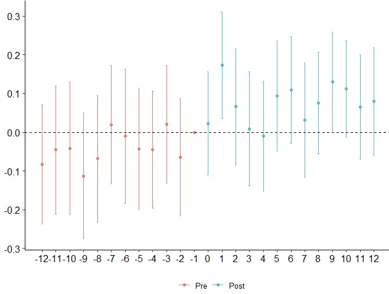

# Analysis of Omnichannel Marketing Strategy: Do Offline Showrooms Increase Online Sales? *(Work-in-Progress)*

## Summary
This project for a Berlin-based e-commerce firm uses confidential online sales data to estimate the causal effect of offline showrooms on online sales. We employ synthetic control methods and difference-in-differences methods to estimate the causal parameters. The results of our analyses suggest that a brick-and-mortar showroom increases online sales in the area surrounding the showroom by 7-20%. The numbers are statistically and economically significant; the more credible estimates are at the lower end of the range. In combination with the costs of operating the showrooms, a "showroom ROI" can be obtained and benchmarked against that of other marketing channels. Therefore, this project provides important inputs that support strategic decision-making on the optimal marketing mix.
<br />
<br />

<p align="center">

</p>

 *This chart shows the evolution of online sales in the time around the opening of a showroom for the areas neighboring the showroom relative to matched control group areas where no showroom opened (red: year-quarters before the opening, green: year-quarters after the opening). The average sales increase (aggregated over all showroom openings) is 7.4% and is statistically significant at the 0.05 level.*


<br>
<br>


**Authors**: <br>
Michael Dietrich ([LinkedIn](https://www.linkedin.com/in/m-dietrich/), [Github](https://github.com/mihyael)) <br>
Benjamin Grosse-Rueschkamp ([LinkedIn](https://www.linkedin.com/in/benjamingrosserueschkamp), [Github](https://github.com/GrosserB)) <br>

**Note**: <br>
The data used for this project is confidential, hence any information shown here that could identify the firm (e.g. showroom location or absolute numbers) are fictionalized. This project is still work-in-progress. <br>
<br />


## Table of Contents
- [Evaluation of Omnichannel Strategy at Berlin-based E-Commerce Company: Do Offline Showrooms Increase Online Sales? -- WORK IN PROGRESS --](#evaluation-of-omnichannel-strategy-at-berlin-based-e-commerce-company-do-offline-showrooms-increase-online-sales----work-in-progress---)
  - [Summary](#summary)
  - [Table of Contents](#table-of-contents)
  - [Description](#description)
    - [Objective](#objective)
    - [Analyses \& Results](#analyses--results)
      - [Data and Introduction](#data-and-introduction)
      - [Event-study Difference-in-Differences with K-Nearest Neighbors](#event-study-difference-in-differences-with-k-nearest-neighbors)
      - [Synthetic Control Method](#synthetic-control-method)
      - [Two-way Fixed-effects Difference-in-Difference](#two-way-fixed-effects-difference-in-difference)
      - [Discussion \& Summary of Results](#discussion--summary-of-results)
    - [So-What](#so-what)
  - [Overview](#overview)
    - [File Structure](#file-structure)
    - [Authors, Acknowledgements](#authors-acknowledgements)
  - [Detailed Project Description](#detailed-project-description)
    - [Overview](#overview-1)
    - [Objectives](#objectives)
    - [Methods Used](#methods-used)
    - [Installation](#installation)
    - [Data Processing / Preparation / Loading / Saving](#data-processing--preparation--loading--saving)
    - [Further Insights Into Data Preprocessing](#further-insights-into-data-preprocessing)
- [Bootcamp Legacy Contents](#bootcamp-legacy-contents)
- [Startup the project](#startup-the-project)
- [Installation](#installation-1)


## Description
### Objective


Fundamentally,
One of the central marketing challenges is to decide on the spending on different channels to optimize overall sales but knowing the ROI of different channels is challenging.

Product and brand information offline, but filfillment online (with some exceptions, see outlets)

uncertainty of buying online

What is the question? Why does it matter?
-> in essence, a marketing-attribution problem, central to marketing/sales strategy,

Does the opening of showrooms increase online sales?

### Analyses & Results

#### Data and Introduction

We start by cleaning and preprocessing of the data (LINK). We aggregate online sales data on the year-quarter level. We also aggregate sales on postal code area level, and geocode the location of the showrooms and of each postal code. We then computed the distance between each showroom-postal code pair. We define areas as "treated" if their location is <50km from a showroom that opened during our sample period as some showrooms had opened before. We additionally augment the dataset with the average population density and credit score of the postal code area (LINK TO DATA DESCRIPTION).

The challenge - as usual with causal inference - is to ensure that we don't misinterpret mere correlations as causal relationships, but instead recover as accurate as possible the "true" parameters. A particular concern in this setting are potentially hidden factors that impact sales and that are also correlated to treatment ("omitted variable bias"). For example, all showrooms are located in urban areas. At the same time, consumers in urban areas may exhibit differential online shopping behaviors compared to consumers in rural areas even in the absence of treatment. For example, the covid lockdowns impacted urban and rural consumer behavior in different ways. Therefore, naive comparisons of online sales in areas with showrooms vs. those without, or simple before-after comparisons are likely to be biased and would lead to misleading conclusions.

PLOT "Pandemic_Growth_by_PopulationDensity"
*brief description of plot*

To tackle these challenges and obtain robust estimates, we employ three state-of-the-art methodologies from the causal inference toolkit: (1) event-study difference-in-differences with k-nearest neigbors to select the control group, (2) synthetic control methods, and (3) heterogenous-robust two-way fixed-effects difference-in-difference estimation methods.

#### Event-study Difference-in-Differences with K-Nearest Neighbors

First, we use nearest neighbor matching to construct a control group. The purpose of the control group is to provide a counterfactual to the treatment group, i.e. to SHOW what would have happened to the treatment group had it not been exposed to the treatment. To obtain the control group, we match treated each postal code area with TWO other postal code areas using nearest neighbor matching based on on the variables (i) population density, (ii) average credit quality and (iii) total online sales in 2015-Q1, the first quarter in our sample. In a multivariate regression, these three variables explain about 70% of the cross-sectional variation in the final quarter of our sample. We match two instead of just one control postal code to each treatment postal code to increase the sample size and thereby reduce the standard errors in our estimation.


1) Plotting online sales in the treated areas vs. those of a matched control group:

PLOT

Interpretation: before the opening of the showroom, online sales grow at similar rates in treatment and control areas, After the showroom opens, the series diverge and the areas around the showroom increase their online order volume at a faster rate. This simple plot provides first evidence to the effect of the showroom on online sales.

To analyze the effect of the showroom opening in more detail, we next run an event-style difference-in-differences regression:

SCREENSHOT TABLE

The tables show the results of the following linear regression: REGRESSION EQUATION IN LATEX
where the variable Post is an indicator variable that equals one for all year-quarters after the showoom opened, and zero otherwise. The variable treatment is an indicator variable that equals one for all postal code areas that are within the 50km range around the showroom, and zero for all control postal code areas. Post_x_Treament is the interaction term of the two variables. The dependent (aka "target") variable is the natural logarithm of one plus the quarterly total order value in each postal code area. As the dependent variable is logarized (CHECK), we can interpret the parameter estimate on the interaction term "Post_x_Treated" as the mean percentage change in order volume for the treated units after the opneing of the showroom, relative to the untreated postal code areas. Hence, the estimates for the two showroom openings show an increase of 10% and 12%. Both estimates are statistically significant.


#### Synthetic Control Method

We next employ the Synthetic Control Method ("SCM") to analyze the effect of the showroom opening online sales. Similarly to the previous methodology, SCM employs a control group as counterfactual, and uses the Post-treatment periods to estimate the treatment effect. The major difference lies in how the control group is constructed. SCM selects weights to construct a synthetic version of the treated unit such that the outcome in the pre-treatment periods matches the outcome of the treated unit as closely as possible. In contrast to DiD, only one aggregated version of the treated unit exists so no parameters are estimated (CHECK). Instead, the simple difference between the actual outcome and the synthetic outcome represents the treatment effect estimate.

3) Synthetic Control Method

PLOT

Descrpition and interpretation: In the pre-treatment period the outcome variable, average sales per postal code area (CHECK) of the synthetic city matches the value of the actual city closely. Then, as the showroom opens, the two series diverge visibly, suggesting a positive impact of the showroom on online sales in the area around the showroom, the absolute treatment effect is then simply the difference between the actual value and the synthetic value. We obtain the percentage increase by dividing the average quarterly increase over the 24 months after the showroom opening by the value in the final quarter before treatment. Averaging over all showroom openings in our sample, the analysis suggests an increase of online sales of around 20% (CHECK).


#### Two-way Fixed-effects Difference-in-Difference

In the first section, we use the standard (or event study-style) difference-in-differences method. The major limitation of that method is that it can only handle one event at a time, without a clear way to aggregate the results, including confidence bands, of multiple events. This is where TWFE is coming in. In recent years,an emerging scientific literature has pointed out flaws of the original TWFE estimator (under some conditions, in particular, multiple time periods and heterogenous or dynamic treatment effects, staggered the estimator delivered biased results). We use the implementation of the corrected version of the TWFE estimator of Callaway & Sant'Anna (2021). It is only available in R. The package runs the following fixed effects regression: LATEX where the variables are defined as in (LINK)

shows the effect of showroom opening on online sales. It plots the difference-in-differences parameters of regressions of online sales on the interaction term of Treatment Group and Year-Quarter indicator variables along its 95%-confidence bands. These values aggregated over all showrooms in our sample. It thus shows the relative development of online sales


group-time effect difference-in-difference estimators of online sales around the opening of showrooms, aggregated over all showroom openings in our sample.

The


 *


PLOT

SCREENSHOT TABLE


#### Discussion & Summary of Results

The results of the analyses show robust evidence of a significant positive effect of offline showrooms on online sales, of between 7% -20%.

The fact that all three methods


 Employing three different quasi-experimental methods, we find a positive effect

How much can we trust


All of the methods employed here are quasi-experimental and let us avaiod as much as possible the omitted variable bias. At the same time,


which is most credible

what are threats/potential limitations


As with all approaches to causal inference on non-experimental data, valid conclusions require strong assumptions. This method assumes that the outcome of the treated unit can be explained in terms of a set of control units that were themselves not affected by the intervention. Furthermore, the relationship between the treated and control units is assumed to remain stable during the post-intervention period. Including only control units in your dataset that meet these assumptions is critical to the reliability of causal estimates.


### Conclusion: "So-What"

Input here the computer on estimated revenue


The results on the impact of opening additional showrooms is to be set in relation to the costs to compute the marketing ROI. This needs to be compared to the ROI of alternative marketing strategies, in particular, performance-marketing.


Potential follow-ons: channels, other outcome variables, euro-figures for potential showrooms in cities not served by showrooms yet.

Talk about long-term vs. short-term: question: do initial gains consolidate, reverse or continue to grow?


## Overview


### File Structure

### Authors, Acknowledgements

Thanking Valentin
Early contributions by acknowledge by Jian and Jean
Thanking the anonymous Berlin-based e-commerce company


## Detailed Setup and Preprocessing Description

### Overview

All parts of the analysis are documented in the jupyter notebook `Main_Project_Notebook.ipynb` together with step-by-step explanations of methods. We provided an example dataset that serves as a basis to explain our approach. It can also be used by anyone to replicate our results.


### Installation

The package can be installed by downloading the contents of this repository/package, navigate to the folder on your command line and typing the following command:

`pip install .`

This will install the contents of this package to your current python environment. Then you should be able to use the notebooks in this package without any trouble. This also enables you to use our method for your own projects.


### Data Processing / Preparation / Loading / Saving

For the purpose of publication, all parts of the analysis start with a dataset, that has already been extensively preprocessed.

For anyone who wants to use our approach for a similar analysis, we give a detailed description of the preprocessed dataset, it's variables and data types. See also the dataset we provided.

`Description of all columns and their data types and contents`


### Further Insights Into Data Preprocessing

As mentioned above, the original data has been significantly altered to comply with a confidentiality agreement. But, the original preprocessing steps for this project have been preserved in `Data_Preprocessing_Notebook.ipynb` and can be accessed in the `notebooks` folder.

Also, the original project used Google's Cloud Storage and BigQuery to store and load the large amounts of data (millions of observations) that would have otherwise exceeded the memory capacity of our machines. Through several preprocessing steps that combined those observations, the data was reduced to merely 400.000 rows, that fit into a single csv file of less than 100MB. A small tutorial on the usage of Google's Cloud Storage and BigQuery for this project is also available in the `Documentation.md` file.


------------------------------------
# Project setup

The initial setup.

Create virtualenv and install the project:
```bash
sudo apt-get install virtualenv python-pip python-dev
deactivate; virtualenv ~/venv ; source ~/venv/bin/activate ;\
    pip install pip -U; pip install -r requirements.txt
```

Unittest test:
```bash
make clean install test
```

Check for MultiChannelStrategy in gitlab.com/{group}.
If your project is not set please add it:

- Create a new project on `gitlab.com/{group}/MultiChannelStrategy`
- Then populate it:

```bash
##   e.g. if group is "{group}" and project_name is "MultiChannelStrategy"
git remote add origin git@github.com:{group}/MultiChannelStrategy.git
git push -u origin master
git push -u origin --tags
```

Functionnal test with a script:

```bash
cd
mkdir tmp
cd tmp
MultiChannelStrategy-run
```

# Installation

Go to `https://github.com/{group}/MultiChannelStrategy` to see the project, manage issues,
setup you ssh public key, ...

Create a python3 virtualenv and activate it:

```bash
sudo apt-get install virtualenv python-pip python-dev
deactivate; virtualenv -ppython3 ~/venv ; source ~/venv/bin/activate
```

Clone the project and install it:

```bash
git clone git@github.com:{group}/MultiChannelStrategy.git
cd MultiChannelStrategy
pip install -r requirements.txt
make clean install test                # install and test
```
Functionnal test with a script:

```bash
cd
mkdir tmp
cd tmp
MultiChannelStrategy-run
```
